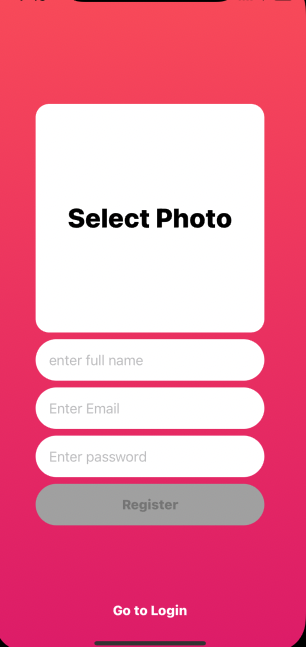
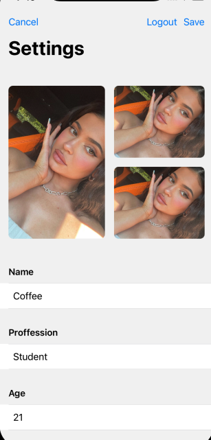
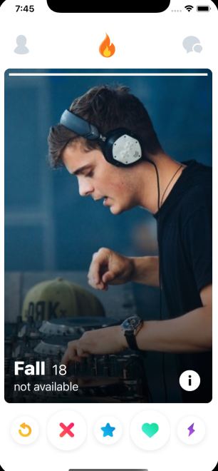
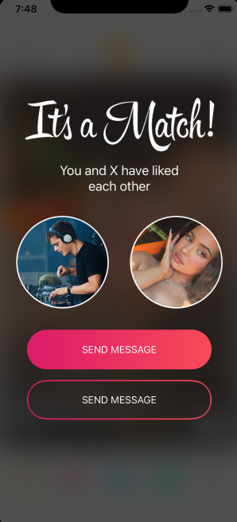

# Swipper
It is a not so unique app that matches users using firebase.  
**Objectives**
 
**Preview**

<table>
<tr>
<td width="25%">

Creating an account

</td>
<td width="25%">

Settings

</td>
<td width="25%">

Matching Newsfeed

</td>
<td width="25%">

Matching Notification

</td>
</tr>
<tr>
<td width="25%">
</img>
</td>
<td width="25%">
</img>
</td>
<td width="25%">
</img>
</td>
<td width="25%">
</img>
</td>
</tr>
</table>

## 🌟 Features

- [x] Creating an account
- [x] Logging in 
- [x] Swipping on users 
- [x] editing profile

**Addition/bugss**
There are still a couple features I would liek to fix.
1. There's a bug when creating an account, for some reason, sometimes it doesnt show swippable users. A quick workaround is changeing the scene delegate to HomeController and logging in that way. 

